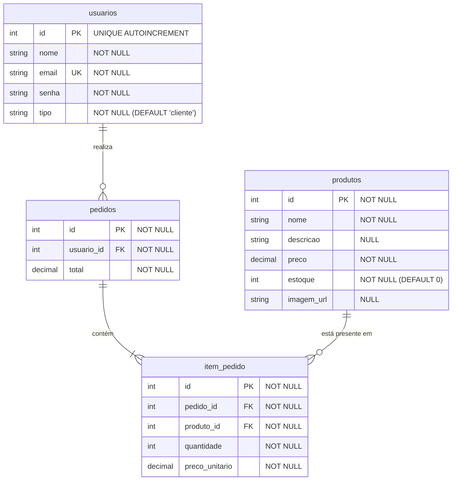

# Explicação dos Relacionamentos entre as Tabelas

## *1. Relacionamento: `usuarios` ➔ `pedidos` (1 : N — Um para Muitos)*

* **Como se ligam**: A tabela `pedidos` possui a chave estrangeira `usuario_id`, que aponta para o `id` da tabela `usuarios`.
* **O que significa**:
* **Um cliente** pode realizar **vários pedidos** ao longo do tempo (por isso a relação é $1:N$).
* **Um pedido** pertence obrigatoriamente a apenas **um único cliente**.
* Se o cliente não fizer nenhuma compra, ele pode ter $0$ pedidos associados.

## *2. Relacionamento: `pedidos` ➔ `item_pedido` (1 : N — Um para Muitos)*

* **Como se ligam**: A tabela `item_pedido` possui a chave estrangeira `pedido_id`, que se conecta ao `id` da tabela `pedidos`.
* **O que significa**:
* **Um pedido** (cabeçalho do checkout) pode conter **um ou vários itens** dentro dele (ex.: um único carrinho com 2 vestidos e 1 saia gera 3 registros em `item_pedido`).
* **Cada item** registrado na tabela `item_pedido` pertence unicamente a **um pedido específico**.

## *3. Relacionamento: `produtos` ➔ `item_pedido` (1 : N — Um para Muitos)*

* **Como se ligam**: A tabela `item_pedido` possui a chave estrangeira `produto_id`, que se conecta ao `id` da tabela `produtos`.
* **O que significa**:
* **Um mesmo produto** pode estar presente em **vários itens de pedidos** efetuados por clientes diferentes em datas distintas.
* **Cada linha** da tabela `item_pedido` refere-se a apenas **um produto** específico no momento da compra.

---

* **`usuarios`**: Tabela central de acessos. Armazena os dados cadastrais (e-mail, senha criptografada) e diferencia as permissões do sistema entre clientes comuns e administradores (`tipo`).

* **`produtos`**: Representa o catálogo de vestuário disponível para venda. Consolida as informações das peças (nome, preço, link da imagem) e mantém o controle direto da quantidade em estoque (`estoque`).

* **`pedidos`**: Representa o ato do checkout (a venda concluída). Guarda o valor total da transação (`total`), a data em que ocorreu (`criado_em`) e quem foi o comprador (`usuario_id`).

* **`item_pedido`**: Armazena o histórico detalhado dos produtos comprados em um pedido específico. Registra a quantidade adquirida e congela o preço do produto no momento da compra (`preco_unitario`), garantindo que alterações futuras no catálogo não afetem o histórico financeiro da venda.